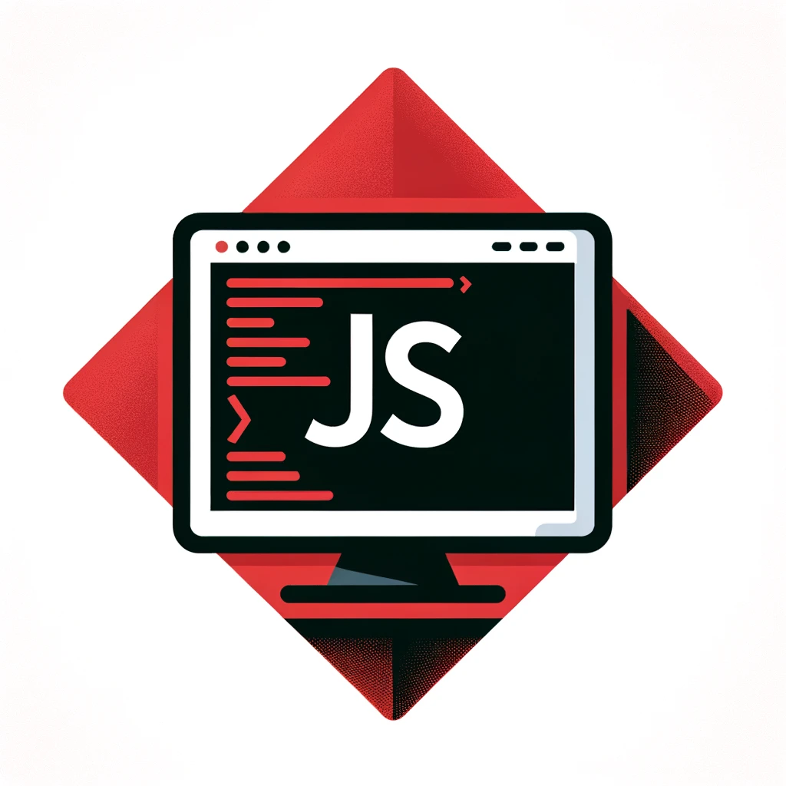
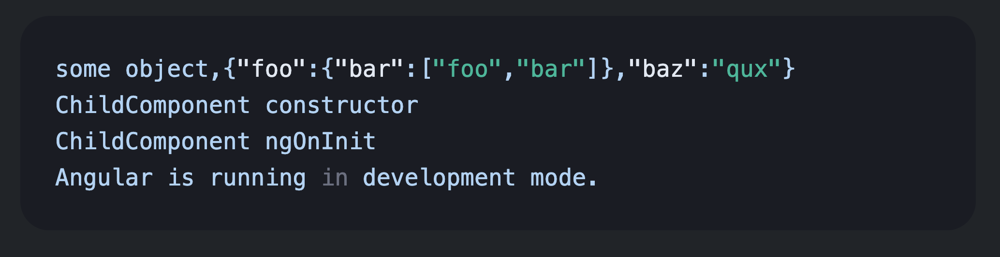

# NgWebConsole




> Display console.log statements in your web page.

<!-- START doctoc generated TOC please keep comment here to allow auto update -->
<!-- DON'T EDIT THIS SECTION, INSTEAD RE-RUN doctoc TO UPDATE -->
**Table of Contents**  *generated with [DocToc](https://github.com/thlorenz/doctoc)*

- [NgWebConsole](#ngwebconsole)
  - [Installation](#installation)
  - [Usage](#usage)

<!-- END doctoc generated TOC please keep comment here to allow auto update -->


## Installation

```bash
npm install ng-web-console
```

## Usage
1. Register the console providers:

```typescript
import { provideNgWebConsole} from "ng-web-console";

// inside your app module or app component
providers: [
    provideNgWebConsole()
]
```

2. Add the console component to the imports array of your module or component:

```typescript
import { NgWebConsoleComponent } from "ng-web-console";

// inside your app module or app component
imports: [
    NgWebConsoleComponent
]
```

3. Start using the console component in your template:

```html
<ng-web-console/>
```

4. Start logging:

```typescript
// use console.log somewhere in your codebase 
console.log("Hello World");
```
